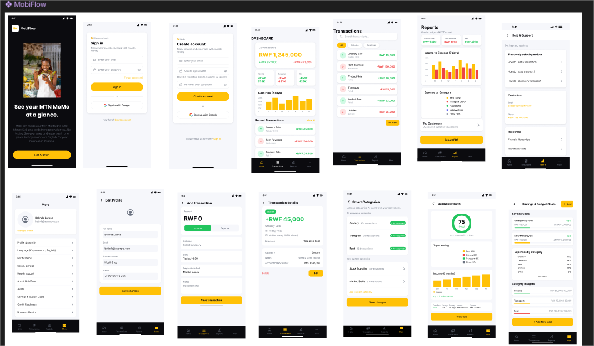

# MobiFlow — A Mobile Financial Visibility Application for Informal SMEs in Rwanda

MobiFlow helps small shop owners, salon owners, and other informal businesses track income and expenses in one place. It uses mobile money and cash, captures transactions automatically from SMS, and offers savings goals, alerts, business health summaries, and a credit-readiness report for lenders.

## Table of Contents

- [Features](#features)
- [Tech Stack](#tech-stack)
- [Quick Start](#quick-start)
- [Prerequisites](#prerequisites)
- [Installation](#installation)
- [Repository Structure](#repository-structure)
- [Architecture Overview](#architecture-overview)
- [Example API Endpoints](#example-api-endpoints)
- [Authentication (Firebase)](#authentication-firebase)
- [Environment Variables](#environment-variables)
- [Testing](#testing)
- [Versioning & Changelog](#versioning--changelog)
- [Deployment](#deployment)
- [Contributing](#contributing)
- [License](#license)
- [Design (Figma)](#design-figma)
- [References & Author](#references--author)

## Features

| Area | Description |
|------|-------------|
| **Transactions** | Add income/expense manually; auto-capture from mobile-money SMS (Android). Scan past SMS to import history. |
| **Savings & budgets** | Set savings goals, track progress, and category budgets with suggestions from past spending. |
| **Alerts** | Low balance, high expenses, and income-drop alerts. |
| **Business health** | 0–100 score, top categories, income trend. Server-backed summary via Cloud Functions. |
| **Credit readiness** | PDF report to share with banks or MFIs. |
| **Financial literacy** | In-app Kinyarwanda videos on saving, credit, and small-business money. |
| **Risk & anomalies** | On-device expense risk score (“Fraud risk” on transaction detail). “Bigger than usual” badge from your own averages. |
| **Top customers** | All-time list of who sent you money (income), by phone/label. |
| **Admin dashboard** | Web app for admins: platform metrics, users, transactions, insights, support requests, and settings. |

## Tech Stack

| Layer | Technologies |
|-------|----------------|
| **Mobile app** | React Native (Expo), TypeScript, Expo Router |
| **Admin dashboard** | React, TypeScript, Vite, Tailwind CSS |
| **Backend** | Firebase Auth, Firestore, Storage, Cloud Functions |
| **Testing** | Jest, React Native Testing Library, Maestro, Vitest |
| **ML / data** | Python, pandas, scikit-learn, Jupyter |

## Quick Start

| Resource | Link |
|----------|------|
| **Demo video** | [Watch on Google Drive](https://drive.google.com/file/d/1sZGbDIiEVUt1p8g_G_9IXd0SdNLsDVrg/view?usp=sharing) |
| **Download APK** | [Releases – MobiFlow APK](https://github.com/Belinda1704/mobiflow-capstone-project/releases) |
| **Project report** | [Analysis, discussion & recommendations](https://docs.google.com/document/d/1mnZ5QHzBgCN8ddCLAgUAqSX9sm2uIqub3y1Dvo9JCws/edit?usp=sharing) |
| **Figma design** | [MobiFlow UI Design](https://www.figma.com/design/xP5KDN2i1uEpY50LbUzHQT/MobiFlow-UI-Design?node-id=0-1) |

**Android APK – install:** Download from [Releases](https://github.com/Belinda1704/mobiflow-capstone-project/releases) (Assets) → open on device → allow “unknown apps” if prompted.  
**Requirements:** Android 14 (API 34)+, 2 GB RAM. The app is **Android only** (no iOS build). SMS capture requires the APK (not Expo Go).

## Prerequisites

- **Node.js** v18+
- **npm**
- **Expo Go** (optional, for quick testing on device)
- **Android Studio** (for Android emulator — the project targets **Android only**; iOS is not supported)
- **Firebase project** (for Auth, Firestore, Storage, Functions)

## Installation

1. **Clone and enter the mobile app**
   ```bash
   git clone https://github.com/Belinda1704/mobiflow-capstone-project.git
   cd mobiflow-capstone-project/mobiflow-app
   ```

2. **Install dependencies**
   ```bash
   npm install
   ```

3. **Configure environment**  
   Create `mobiflow-app/.env` with your Firebase web app credentials (see [Environment Variables](#environment-variables)).

4. **Start the dev server**
   ```bash
   npx expo start
   ```
   Press **`a`** for Android emulator, or scan the QR code with Expo Go on an Android device.

**Admin dashboard:** `cd admin-dashboard && npm install && npm run dev` (after setting env; see [Environment Variables](#environment-variables)).

## Repository Structure

```text
mobiflow-capstone-project/
├── README.md
├── firebase.json               # Firebase config (Firestore, Storage, functions)
├── firestore.rules
├── storage.rules               # Firebase Storage (cloud backups; deploy with Firebase CLI)
│
├── mobiflow-app/               # Mobile app (React Native / Expo)
│   ├── app/                    # Screens (Expo Router)
│   ├── components/, hooks/, services/, utils/, constants/, locales/, config/
│   └── app/assets/images/      # App icon, splash, favicon; Figma design (mobiflow-figma-design.png) for README
│
├── admin-dashboard/            # Admin web app (React + Vite)
│   └── src/pages/, components/, services/, auth/
│
├── functions/                  # Firebase Cloud Functions (Node.js)
│   └── index.js
│
└── fraud-detection-model/      # Jupyter notebook (fraud model)
```

## Architecture Overview

**Mobile app backend:** The mobile app uses **Firebase** as its backend: **Auth** (sign up/sign in), **Firestore** (transactions, user settings, savings goals, lesson completions, support requests), and **Storage** (profile photos). Server logic runs in **Firebase Cloud Functions**: business health score, credit-readiness report summary, and any aggregated data the app needs. The app talks to Firestore and Storage directly (with security rules) and calls callable functions for health and report data.

- **Mobile app (Expo)** → Firebase Auth, Firestore, Storage; callable **Cloud Functions** for health score and report summary.
- **Admin dashboard (Vite/React)** → Firebase Auth (admin users only), Firestore where needed, **Cloud Functions** for dashboard metrics, users, transactions, insights, and support requests.
- **Cloud Functions** → Used for aggregated metrics, business health, report summary, and admin API.

## Example API Endpoints

Backend is **Firebase Cloud Functions** (callable from the app and admin dashboard). Main endpoints:

| Purpose | How it’s used |
|--------|----------------|
| **Admin dashboard data** | Callable `getDashboardOverview` (metrics, activity, date range). Invoked by `admin-dashboard` with auth. |
| **Business health** | HTTP or callable for health score / report summary. Used by mobile app. |
| **Report summary** | Callable for credit-readiness / report data. Used by mobile app. |

Example (admin dashboard): `getFunctions().httpsCallable('getDashboardOverview')({ dateRange, startDate, endDate })`.  
Authentication is via Firebase Auth; the function checks the user’s admin claim or email allowlist.

## Authentication (Firebase)

- **Mobile app:** Firebase Authentication (email/password or phone as used in the app). Users sign up / sign in; tokens are used for Firestore and Storage.
- **Admin dashboard:** Firebase Authentication with email/password. Only accounts that exist in your admin list (e.g. Firestore or env) can access the dashboard; the app and Cloud Functions enforce this.

## Environment Variables

- **On your machine:** create **`mobiflow-app/.env`** (and optionally **`admin-dashboard/.env`**) with your Firebase keys. **Never commit `.env`** — it is gitignored.
- **Variable names and setup:** see the table below and **[`docs/LOCAL_ENV_SETUP.md`](docs/LOCAL_ENV_SETUP.md)**.

**Names you need** (values from **Firebase Console → Project settings → Web app → `firebaseConfig`**):

| Variable | Purpose |
|----------|---------|
| `EXPO_PUBLIC_FIREBASE_API_KEY` | Web API key |
| `EXPO_PUBLIC_FIREBASE_AUTH_DOMAIN` | e.g. `project.firebaseapp.com` |
| `EXPO_PUBLIC_FIREBASE_PROJECT_ID` | Project ID |
| `EXPO_PUBLIC_FIREBASE_STORAGE_BUCKET` | Storage bucket |
| `EXPO_PUBLIC_FIREBASE_MESSAGING_SENDER_ID` | Sender ID |
| `EXPO_PUBLIC_FIREBASE_APP_ID` | Web app ID |
| `EXPO_PUBLIC_FIREBASE_FUNCTIONS_REGION` | Optional; default `us-central1` |

**Admin dashboard** uses the same names; Vite reads `admin-dashboard/.env` then `mobiflow-app/.env`. Ensure admin users exist in Firebase Auth and pass your admin checks.

## Testing

- **Mobile app – unit/integration (Jest)**  
  - Location: `mobiflow-app/__tests__`  
  - Run: `cd mobiflow-app && npm test`  
  - Coverage: `npx jest --coverage`

- **Mobile app – E2E (Maestro, Android)**  
  - Flows: `mobiflow-app/maestro/flows/*.yaml`  
  - Run (device/emulator connected): `maestro test maestro/flows/onboarding.yaml`

- **Admin dashboard (Vitest)**  
  - Run: `cd admin-dashboard && npm test`

## Versioning & Changelog

Releases and version history are maintained on GitHub:

- **Releases (APK and version tags):** [Releases](https://github.com/Belinda1704/mobiflow-capstone-project/releases)  
- For a changelog, add a `CHANGELOG.md` in the repo or describe changes in the Release notes for each tag.

## Deployment

- **Mobile app (APK):** Build locally (e.g. with the project’s Android build script and short-path setup). Output: signed or debug APK; distribute via [Releases](https://github.com/Belinda1704/mobiflow-capstone-project/releases) or direct install.
- **Firebase (Firestore, Storage, Functions):** `firebase deploy` (or `firebase deploy --only firestore:rules`, `--only storage`, `--only functions`). **Cloud backup** needs Storage rules deployed (`storage.rules`); without them uploads fail with permission errors.
- **Admin dashboard:** Deployed on [Render](https://render.com). Build with `cd admin-dashboard && npm run build`; the `dist/` output is deployed as a static site on Render.

## Contributing

Contributions are welcome. Please open an issue to discuss larger changes, then submit a pull request. Ensure tests pass (`mobiflow-app`: `npm test`; `admin-dashboard`: `npm test`).

## License

This project is licensed under the MIT License. See the [LICENSE](LICENSE) file for details.

## Design (Figma)

UI and flows were designed in Figma.

**Figma file:** [MobiFlow UI Design](https://www.figma.com/design/xP5KDN2i1uEpY50LbUzHQT/MobiFlow-UI-Design?node-id=0-1)



## References & Author

- [Expo](https://docs.expo.dev/) · [React Native](https://reactnative.dev/docs/getting-started) · [Firebase](https://firebase.google.com/docs) · [React Navigation](https://reactnavigation.org/docs/getting-started)
- [Jest](https://jestjs.io/docs/getting-started) · [Maestro](https://maestro.mobile.dev/)
- [react-native-youtube-iframe](https://github.com/LonelyCpp/react-native-youtube-iframe) · [scikit-learn LogisticRegression](https://scikit-learn.org/stable/modules/generated/sklearn.linear_model.LogisticRegression.html)

**Author:** Belinda Belange Larose
